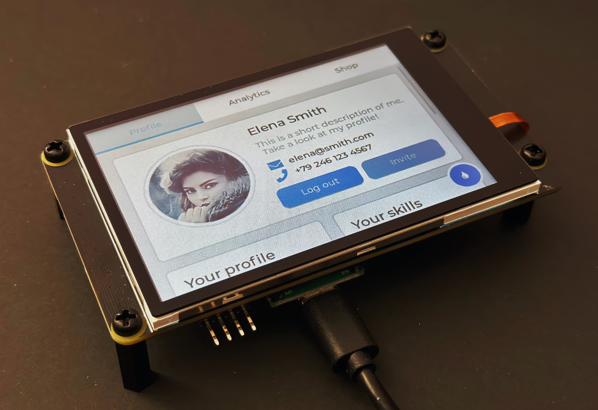
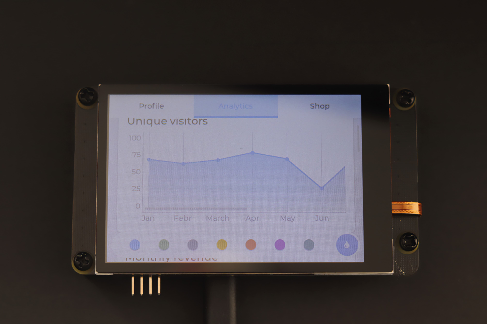

# Pico_DM_QD3503728

#### Raspberrypi Pico Display Module with LVGL, Micropython support start at 69.8￥(9.9$)

### Technical specifications
| Part | Model |
| --- | --- |
| Core Board | Rasberrypi Pico |
| Display | 3.5' 480x320 ILI9488 no IPS |
| | 16-bit 8080 50MHz |
| TouchScreen | 3.5' FT6236 capacity touch |

### Pinout

| Left | Right |
| --- | --- |
| GP0/DB0 | VBUS |
| GP1/DB1 | VSYS |
| GND | GND |
| GP2/DB2 | 3V3_EN |
| ... | ... |

